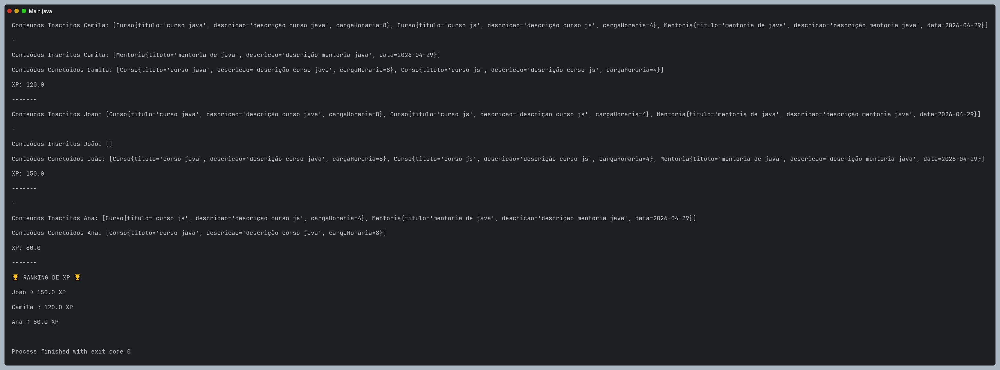

# ☕ Abstraindo um Bootcamp com Orientação a Objetos em Java

> 🎓 Projeto desenvolvido durante o **Bootcamp Almaviva Solutions — Back-end com Java & QA** na plataforma [DIO](https://www.dio.me)
>
> 📌 Desafio: **Abstraindo um Bootcamp Usando Orientação a Objetos em Java**

---

## 📖 Sobre o projeto

Modelagem de um sistema de Bootcamp utilizando os **4 pilares da Programação Orientada a Objetos**, onde Devs podem se inscrever em bootcamps, progredir em conteúdos e acumular XP.

---

## 🧱 Os 4 Pilares do POO aplicados

| Pilar | Como foi aplicado |
|-------|------------------|
| **Abstração** | Classe abstrata `Conteudo` representa o conceito genérico de curso ou mentoria |
| **Encapsulamento** | Atributos privados acessados apenas via getters e setters |
| **Herança** | `Curso` e `Mentoria` herdam de `Conteudo`, reaproveitando atributos e métodos |
| **Polimorfismo** | Cada subclasse implementa `calcularXp()` de forma diferente |

---

## 📁 Estrutura do projeto

```
src/
└── br/com/dio/desafio/dominio/
    ├── Conteudo.java        # Classe abstrata — base de Curso e Mentoria
    ├── Curso.java           # Herda Conteudo — XP baseado na carga horária
    ├── Mentoria.java        # Herda Conteudo — XP fixo + bônus
    ├── Bootcamp.java        # Agrupa conteúdos e devs inscritos
    └── Dev.java             # Gerencia inscrições, progressão e XP
Main.java                    # Classe principal — simulação do bootcamp
```

---

## ✨ Melhorias implementadas

### ⚡ Stream em `calcularTotalXp()`
O código original usava `Iterator` de forma verbosa. Substituído pela versão moderna com **Stream API**:

```java
// Antes — com Iterator (7 linhas)
Iterator<Conteudo> iterator = this.conteudosConcluidos.iterator();
double soma = 0;
while(iterator.hasNext()){
    double next = iterator.next().calcularXp();
    soma += next;
}
return soma;

// Depois — com Stream (3 linhas)
return this.conteudosConcluidos
        .stream()
        .mapToDouble(Conteudo::calcularXp)
        .sum();
```

### 🏆 Ranking de XP
Adicionado ao `Main.java` um ranking final que lista os devs ordenados por XP usando Stream:

```java
devs.stream()
    .sorted(Comparator.comparingDouble(Dev::calcularTotalXp).reversed())
    .forEach(dev -> System.out.println(dev.getNome() + " → " + dev.calcularTotalXp() + " XP"));
```

### 👩‍💻 Terceiro Dev
Adicionado um terceiro desenvolvedor (**Ana**) para enriquecer a simulação.

---

## 🖥️ Demonstração



---

## 🧮 Como funciona o cálculo de XP

| Conteúdo | Fórmula | Exemplo |
|----------|---------|---------|
| `Curso` | `XP_PADRÃO (10) × carga horária` | Curso de 8h = 80 XP |
| `Mentoria` | `XP_PADRÃO (10) + 20` | Mentoria = 30 XP |

---

## 🛠️ Tecnologias utilizadas

- **Java 11+**
- **IntelliJ IDEA**

---

## ⚙️ Como executar

### 📌 Pré-requisitos
- Java 11+ instalado
- IntelliJ IDEA (recomendado)

### ▶️ Passo a passo

**1. Clone o repositório**
```bash
git clone https://github.com/Zenobya/desafio-poo-dio.git
```

**2. Abra na IDE**

**3. Execute a classe `Main.java`**

---

## 📄 Licença

Este projeto está sob a licença **MIT**.

---

## 👩‍💻 Autora

Desenvolvido por **Camila Machado - Zenóbya** ✨

[](https://github.com/Zenobya)
[](https://www.dio.me)
[](https://www.dio.me)
